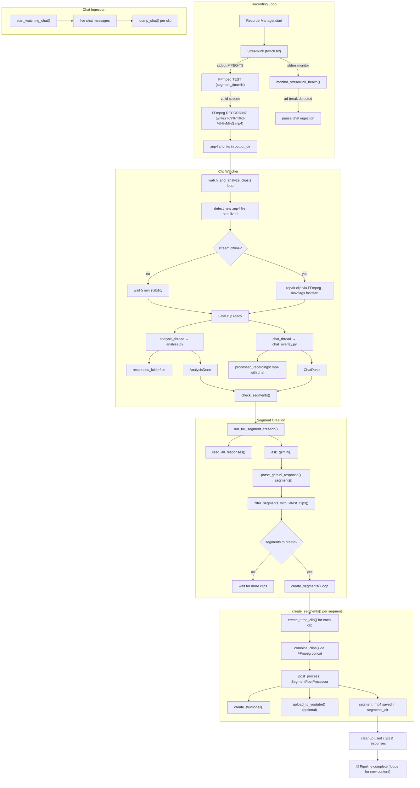

Automatically watches Twitch streams and uses AI to make segments in real time and upload them to Youtube.

Clipped xQc for ~two weeks before getting banned for impersonation?? (not even related to the auto clipping, just because the account didn't make it clear it wasn't really xQc. I disagree with the ruling 🙁)

